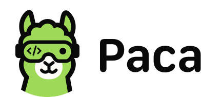

  

<h1 align="center">Paca</h1>

<strong>The open-source, AI-native alternative to Jira, ClickUp, and Monday.</strong>

  A collaborative task management engine designed for <strong>Complex Projects</strong>. 
  Integrating AI Agents directly into Scrum teams as first-class, collaborative peers.

  <a href="docs/guides/getting-started.md">Getting Started</a>
  ·
  <a href="docs/architecture/overview.md">Architecture</a>
  ·
  <a href="CONTRIBUTING.md">Contributing</a>
  ·
  <a href="ROADMAP.md">Roadmap</a>

---

## Why Paca?

Traditional project management tools treat AI as a peripheral "plugin." **Paca is built for the "Complex" domain of the Cynefin/Stacey framework**, where requirements are emergent and the path forward is unpredictable. 

In these complex environments, Scrum is the best way to navigate uncertainty. Paca enhances this by creating a **Human-in-the-loop** ecosystem where AI Agents and human experts collaborate on the same backlog and Scrumban board to inspect and adapt in real-time.

### Navigating Complexity with AI
Unlike simple automation, Paca is engineered for projects that require constant alignment. It ensures that AI Agents don't just "generate code" in isolation, but actively participate in the **Scrum** process—helping the team probe, sense, and respond to complex challenges.

---

## Comparison: Why Paca Stands Out

| Feature | Paca | Multica | Paperclip |
| :--- | :--- | :--- | :--- |
| **Primary Use Case** | **Complex Projects (Scrum)** | Personal AI Research/Dev | AI-assisted Coding |
| **Team Framework** | **Strict Scrum / Scrumban** | Ad-hoc / Experimental | Individual Dev Flow |
| **Workflow** | **Human-in-the-loop (Team-centric)** | Solo-user (Agent-centric) | Individual Developer |
| **Target Audience** | **Cross-functional Teams (PO/BA/Dev)** | Power Users / Researchers | Software Engineers |
| **Project Focus** | **High Uncertainty & Emergent Goals** | Task Automation | Code Completion |
| **Management** | **Jira/ClickUp Alternative** | Browser/Desktop Tool | VS Code Extension |

---

## The Collaborative Pillars: BDD & SDD

Paca centralizes the source of truth, ensuring that even in highly volatile projects, non-tech stakeholders and AI Agents stay perfectly in sync:

* **BDD (Behavior-Driven Development):** Align POs, BAs, and Agents through Gherkin-style scenarios. It defines the *behavior* the team is aiming for in the next sprint.
* **SDD (System Design Document):** A dedicated module for evolving system architecture. By keeping SDDs on Paca, the system’s design remains transparent to non-tech members and provides the "contextual map" AI Agents need to solve complex tasks without losing sight of the big picture.

## The P-A-C-A Cycle

1. **Plan**: Strategic planning and documentation of BDD specs and SDD designs.
2. **Act**: Sprint execution. AI and humans pick up tasks from the shared board.
3. **Check**: Continuous verification through automated QA agents and human review.
4. **Adapt**: Data-driven analysis to optimize the next sprint cycle based on what the team learned.

## Key Features

- **AI-PO & BA Support**: Collaborate with AI to refine the backlog and break down "complex" epics into structured BDD scenarios.
- **Unified Scrumban Board**: A real-time workspace where humans and Agents update statuses and discuss requirements together.
- **SDD Documentation Hub**: High-level documentation that bridges the gap between code and business logic for the entire team.
- **MCP Server Integration**: Connect your AI agents (Claude, custom agents) directly to Paca via Model Context Protocol for seamless project management automation.
- **Server-Side Agent Orchestration**: Agents run on your infrastructure, maintaining full team context and security.
- **Open Source**: Complete control over your project management environment and AI data.

## The "Paca" Story

Why the name Paca? It started as a small pun on the Japanese word **"Baka" (ばか)**, meaning "silly." 

In the early days, we jokingly called our AI assistants "silly" whenever they hallucinated. Building a high-end project management platform as an open-source project might also seem a bit "silly" in a market dominated by multi-billion dollar corporations.

But Paca is a project born from passion, not profit. We believe there is wisdom in being "foolish" enough to chase a vision where human-AI collaboration is accessible to every Scrum team, everywhere. 🦙✨

## Documentation Map

- [CONTRIBUTING.md](CONTRIBUTING.md): how to contribute to Paca.
- [ROADMAP.md](ROADMAP.md): project roadmap and future plans.
- [docs/README.md](docs/README.md): documentation index.
- [docs/architecture/overview.md](docs/architecture/overview.md): high-level system architecture.
- [docs/guides/mcp-server-setup.md](docs/guides/mcp-server-setup.md): setup guide for integrating AI agents via MCP server.

## License

Distributed under the **Apache License 2.0**.
